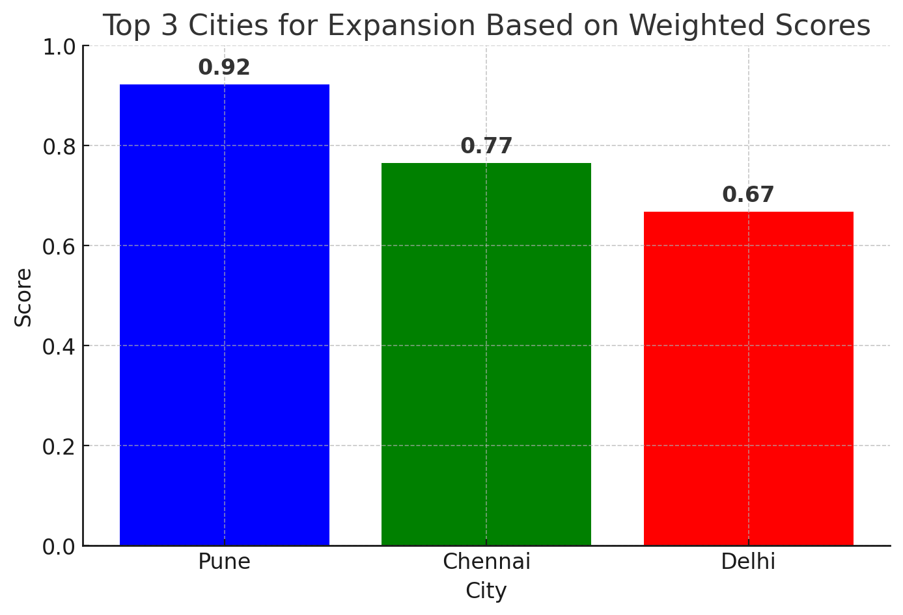

# 📊 Business Expansion Analysis

## 📌 Overview
This project analyzes multiple cities based on key business metrics to determine the top locations for expansion. The dataset includes total sales, estimated coffee consumers, average sales per customer, and rent per customer. A weighted scoring system was used to rank the cities and identify the best expansion opportunities.

## 🗂️ Dataset
The dataset consists of four main tables:

### **1. Products**
- **product_id** – Unique identifier for each product
- **product_name** – Name of the product
- **price** – Price of the product

### **2. Sales**
- **sale_id** – Unique identifier for each sale
- **sale_date** – Date of the sale
- **customer_id** – ID of the customer who made the purchase
- **product_id** – ID of the product sold
- **rating** – Customer rating for the purchase
- **total** – Total amount of the sale

### **3. Customers**
- **customer_id** – Unique identifier for each customer
- **customer_name** – Name of the customer
- **city_id** – ID of the city where the customer is located

### **4. City**
- **city_id** – Unique identifier for each city
- **city_name** – Name of the city
- **city_rank** – Rank of the city based on business potential
- **estimated_rent** – Estimated rent costs in the city
- **population** – Total population of the city

## 📊 City Performance Analysis
A CSV file (**city_performance.csv**) was generated to showcase the performance of each city based on key metrics. The table below represents the city-wise scores before applying weights:

| City Name | Total Sales | Estimated Consumers | Avg Sale per Customer | Avg Rent per Customer |
|-----------|------------|---------------------|----------------------|----------------------|
| Pune      | 1258290    | 1875000             | 24198                | 294                  |
| Chennai   | 944120     | 2775000             | 22479                | 407                  |
| Bangalore | 860110     | 3075000             | 22054                | 762                  |
| Delhi     | 750420     | 7750000             | 11036                | 331                  |

## 🏆 Weighted Scoring Methodology
To rank the cities, a weighted scoring system was applied:
- **Total Sales** (50%) – Higher revenue is prioritized
- **Estimated Consumers** (30%) – A larger customer base is advantageous
- **Average Sale per Customer** (40%) – Higher spending per customer is beneficial
- **Average Rent per Customer** (-20%) – Higher rent negatively impacts the score

### **Calculation Formula:**
Each city's weighted score is calculated as:
```
Final Score = (Total Sales * 0.5) + (Estimated Consumers * 0.3) + (Avg Sale per Customer * 0.4) - (Avg Rent per Customer * 0.2)
```

## 📈 Results: Top 3 Cities for Expansion
After normalizing the data and applying the weighted formula, the top 3 cities for expansion are:
1. **Pune** – Strong revenue, high spending per customer, and reasonable rent
2. **Chennai** – Large customer base with solid sales numbers
3. **Delhi** – Significant market potential despite moderate average sales per customer

## 📊 Visualization
A bar chart was generated to represent the final rankings. The visualization highlights how each city performed based on the weighted scoring system.

